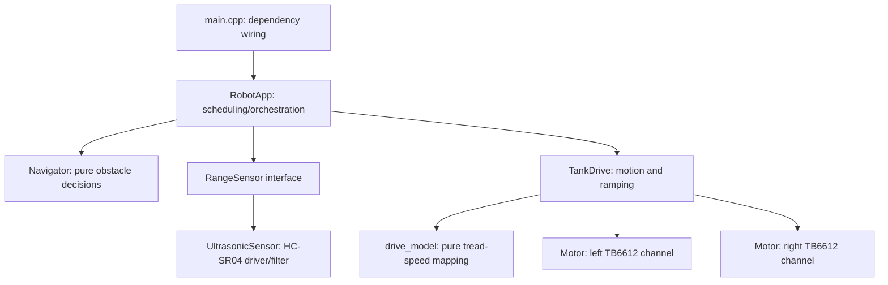

# Firmware architecture

The firmware is split by responsibility so hardware can change without rewriting behavior.

## Boundaries

- `main.cpp` constructs the selected parts and connects them. It contains no robot behavior.
- `RobotApp` schedules sensor reads, asks `Navigator` what to do, and sends the result to the drive.
- `RangeSensor` is the small interface any future distance sensor must implement.
- `UltrasonicSensor` owns HC-SR04 timing and median filtering.
- `Navigator` is hardware-independent state logic and compiles in desktop tests.
- `TankDrive` translates requested motion into two ramped motor commands.
- `drive_model` contains pure speed mapping/ramping functions for desktop tests.
- `Motor` owns one TB6612 channel and is the only module that writes its direction/PWM pins.
- `config.h` is the single place for pins, speeds, distances, and timings.

Objects are statically allocated: there is no heap allocation in the control path.

## Extension patterns

### Servo-mounted sonar

Create a `ScanningRangeSensor` implementing `RangeSensor`. It can own an `UltrasonicSensor` and servo, expose a nonblocking scan state machine, and return the chosen reading. Only the object construction in `main.cpp` changes. A richer left/center/right result would justify a new sensor interface and navigator strategy rather than adding servo details to `RobotApp`.

### Bluetooth or Wi-Fi control

Add a controller that produces `Motion` commands and a mode selector (`Manual` or `Autonomous`). Let `RobotApp` choose between that controller and `Navigator`; keep networking out of `TankDrive`. Always define disconnect/timeout behavior as `Stop`.

### Wheel encoders

Add an `Encoder` driver per tread, then a closed-loop drive implementation using the same high-level motion commands. Keep interrupt handlers tiny and store counts in volatile integers. Navigation need not know how speed is controlled.

### More sensors

For another single distance sensor, implement `RangeSensor` and swap it in `main.cpp`. For bumpers, cliff sensors, or several range directions, define a `RobotPerception` value containing all observations and evolve `Navigator::update` to accept it. This keeps safety decisions testable without Arduino hardware.

### New behaviors

Extract a `Behavior` interface returning `Motion` when a second behavior is actually needed. Avoid an interface hierarchy before then: `Navigator` already provides the correct seam for the current one-behavior rover.

## Testing rule

Logic that does not require GPIO belongs in a hardware-free `.cpp` file and the native PlatformIO environment. Hardware drivers are verified by compiling the ESP32 environment and then bench-testing with the treads lifted.

