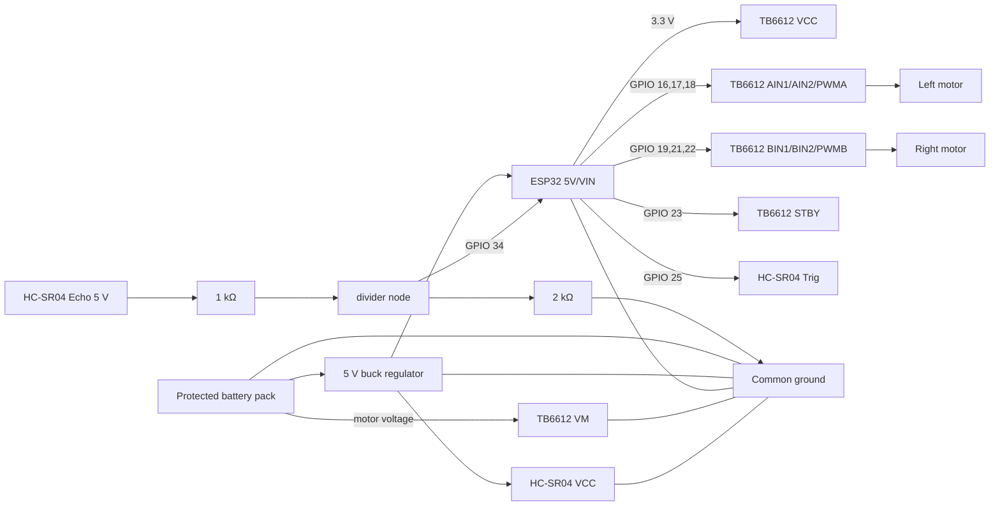

# Wiring

Disconnect the battery while wiring. USB alone is useful for the first sensor test.



## TB6612FNG

- `VM`: motor power. Use the voltage specified for your motors, within the driver's limits.
- `VCC`: 3.3 V logic power from the ESP32.
- `GND`/`PGND`: common ground; connect all ground pins present on your breakout.
- `AO1/AO2`: left motor; `BO1/BO2`: right motor.
- `STBY`: GPIO 23. It must be high for the motors to run.

Do not confuse `VM` with `VCC`. Never feed the motor supply into the ESP32 3.3 V pin.

## HC-SR04 level divider

The sensor's Echo output is approximately 5 V, above the ESP32 GPIO limit. Wire:

```text
HC-SR04 Echo --- 1 kΩ ---+--- GPIO 34
                         |
                        2 kΩ
                         |
                        GND
```

This produces about 3.3 V at GPIO 34. Do not omit it. Trig accepts the ESP32's 3.3 V signal on typical HC-SR04 modules.

## Noise control

- Add a 0.1 µF ceramic capacitor directly across each motor's terminals.
- Keep motor wires short or twisted and away from Echo/Trig wires.
- Put a bulk capacitor (for example 470 µF) across `VM` and ground near the driver, observing polarity and voltage rating.
- If the ESP32 resets when motors start, improve the 5 V regulator/wiring; do not paper over it in software.

